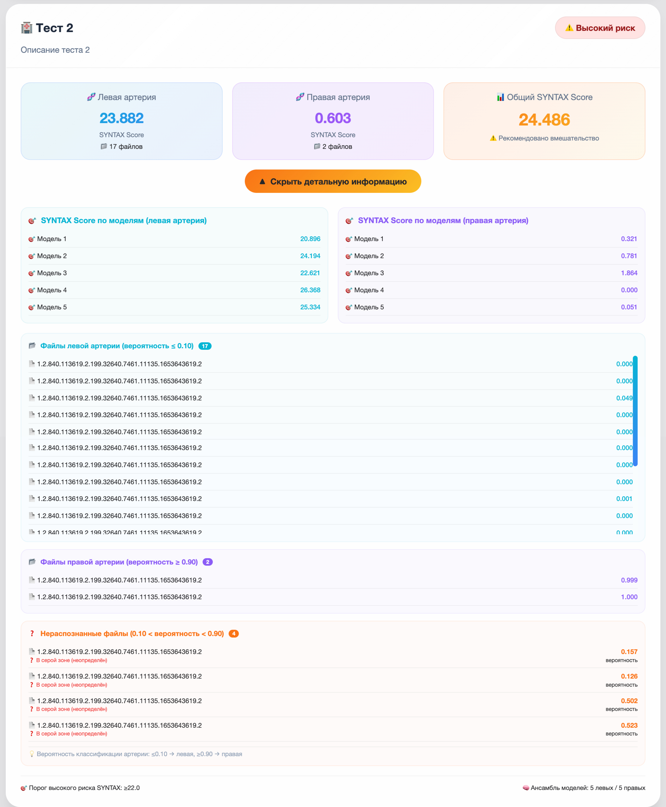

# AutoAngioScore

<div align="center">


**Веб-приложение для автоматической оценки степени коронарного поражения по видеозаписям коронарной ангиографии**

</div>


## 📋 О проекте

**AutoAngioScore** — веб-приложение для автоматической количественной оценки SYNTAX Score по DICOM-видеозаписям коронарной ангиографии (модальность XA). Система использует ансамбль нейросетей (3D ResNet + LSTM) и автоматически классифицирует видеоролики на левую/правую коронарную артерию с порогами 0.10/0.90.

**Клиническая значимость:** SYNTAX Score — стандартизированный инструмент оценки сложности коронарного поражения, влияющий на выбор стратегии лечения. AutoAngioScore сокращает время расчёта с 15–20 минут до < 1 минуты.


## ✨ Возможности

| Функция | Описание |
|---------|----------|
| **Загрузка DICOM** | Поддержка отдельных файлов и папок, валидация формата |
| **Классификация артерий** | Автоматическое определение LCA/RCA (пороги 0.10/0.90) |
| **Ансамблевый инференс** | 5 моделей для LCA + 5 моделей для RCA |
| **Расчёт SYNTAX Score** | Отдельно для LCA, RCA и суммарное значение |
| **Стратификация риска** | Бинарный флаг при SYNTAX > 22 |
| **Двухуровневый UI** | Компактные карточки + раскрываемые блоки |
| **Сохранение в PostgreSQL** | Полная история исследований и результатов |
| **Docker-развёртывание** | Запуск одной командой |


## 🚀 Быстрый старт

### Docker Compose (рекомендуемый)

```bash
git clone https://github.com/MesserMMP/syntax-video-infer.git
cd syntax-video-infer
docker-compose up --build
```

После запуска откройте браузер: **http://localhost:7860**

### Локальная установка

```bash
git clone https://github.com/MesserMMP/syntax-video-infer.git
cd syntax-video-infer
python -m venv venv
source venv/bin/activate  # Windows: venv\Scripts\activate
pip install -r requirements.txt
python app.py
```


## 🖥️ Пользовательский интерфейс

### Компактное отображение результатов

После обработки двух исследований отображаются три карточки для каждого: левая артерия, правая артерия, общий SYNTAX Score с цветовым индикатором риска.

[](screenshots/ui_compact.png)

### Детализированное отображение информации

При нажатии на кнопку **«Показать детальную информацию»** раскрывается блок с:
- оценками каждой модели ансамбля (5 для левой, 5 для правой артерии);
- полными списками DICOM-файлов с вероятностями классификации;
- нераспознанными файлами (серая зона 0.10–0.90).

[](screenshots/ui_detailed.png)


## 📁 Структура проекта

```
syntax-video-infer/
├── app.py                          # Точка входа, веб-интерфейс Gradio
├── docker-compose.yml              # Оркестрация PostgreSQL и приложения
├── Dockerfile                      # Сборка образа
├── requirements.txt                # Зависимости Python
├── .env                            # Переменные окружения (БД)
├── configs/
│   └── default.yaml                # Конфигурация моделей и порогов
├── src/
│   ├── syntax_pred/                # ML-модули инференса
│   │   ├── preprocess.py           # Чтение DICOM и трансформации
│   │   ├── artery_cls.py           # Классификатор LCA/RCA
│   │   ├── model.py                # Архитектура модели SYNTAX
│   │   ├── infer.py                # Основной пайплайн инференса
│   │   └── hf_weights.py           # Загрузка весов из Hugging Face
│   └── database/                   # Модуль PostgreSQL
│       ├── models.py               # SQLAlchemy-модели
│       └── db_manager.py           # CRUD операции
├── assets/
│   └── logo.png                    # Логотип приложения (если есть)
└── screenshots/                    # Скриншоты интерфейса
    ├── ui_compact.png
    └── ui_detailed.png
```


## ⚙️ Конфигурация

### configs/default.yaml (основные параметры)

```yaml
# Видеопараметры
frames_per_clip: 32
video_size: [256, 256]

# Архитектура
backbone: r3d_18
variant: lstm_mean

# Пороги SYNTAX Score
thresholds:
  both: 22.0

# Классификатор артерий
classifier:
  thresholds:
    left_max: 0.10      # ≤0.10 → левая артерия
    right_min: 0.90     # ≥0.90 → правая артерия
```

### .env (переменные окружения)

```env
DB_HOST=localhost
DB_PORT=5432
DB_NAME=autoangioscore
DB_USER=postgres
DB_PASSWORD=your_password
```


## 🗄️ База данных PostgreSQL

При первом запуске таблицы создаются автоматически. Схема включает:

| Таблица | Назначение |
|---------|------------|
| `studies` | Исследования (ID, описание, даты) |
| `dicom_files` | DICOM-файлы (путь, классификация, вероятность) |
| `inference_results` | Результаты SYNTAX Score |
| `artery_scores` | Оценки каждой модели ансамбля |


## Внешние ресурсы

- [Датасет](https://huggingface.co/datasets/MesserMMP/coronary-angiography-syntax) — коронарная ангиография с SYNTAX аннотациями
- [Веса моделей](https://huggingface.co/MesserMMP/syntax-video-weights) — обученные ансамбли
- [Демо-пространство](https://huggingface.co/spaces/MesserMMP/syntax-video-infer) — интерактивная демонстрация
- [Обучение моделей](https://huggingface.co/MesserMMP/coronary-syntax-prediction) - код для дальнейшего обучения моделей


## 📄 Лицензия

MIT License. Подробности в файле [LICENSE](LICENSE).


## 👥 Авторы

**Разработчик:** Панасюк Михаил Михайлович (БПИ226, НИУ ВШЭ)  
**Руководитель ВКР:** Савченко А. В.

- Hugging Face: [@MesserMMP](https://huggingface.co/MesserMMP)
